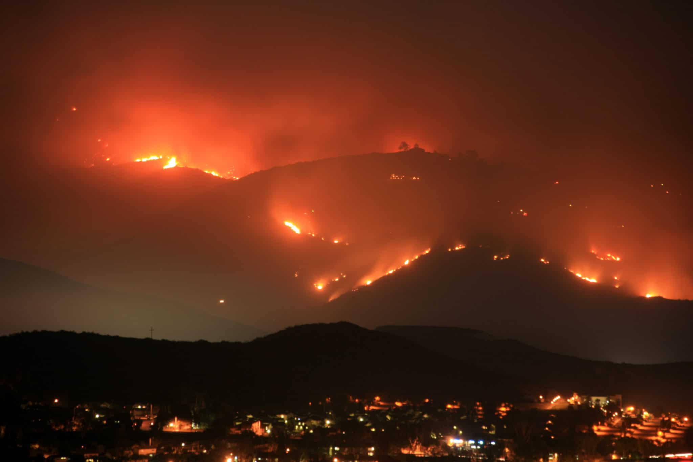
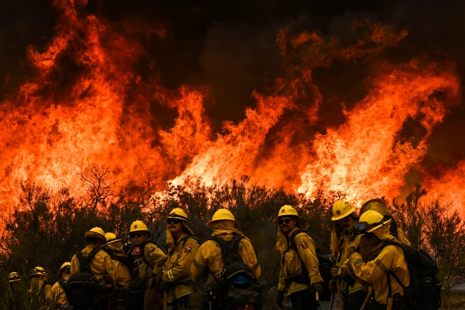

<p float="left">
  
</p>
<style>H1{color:Red;}</style>
<style>H2{color:DarkOrange;}</style>
<style>H3{color:DarkOrange;}</style>
# Informational Page
<p align="center">
  
&nbsp; &nbsp; &nbsp; &nbsp;
  
</p>
## Why this is important


<table border="0">
 <tr>
    <td><b style="font-size:30px">Facts</b></td>
    <td><b style="font-size:30px">Data</b></td>
 </tr>
 <tr>
    <td>
      <ul>
          <li>facts about fire</li>
          <li>Reasons why its important</li>
        </ul>
   </td>
    <td>
       <ul>
          <li>Actaul data of fire's in California</li>
          <li>How it has changed over time</li>
        </ul>
   </td>
 </tr>
</table>
<p align="center">
  
&nbsp; &nbsp; &nbsp; &nbsp;
</p>
``` more information on California fire's ```
